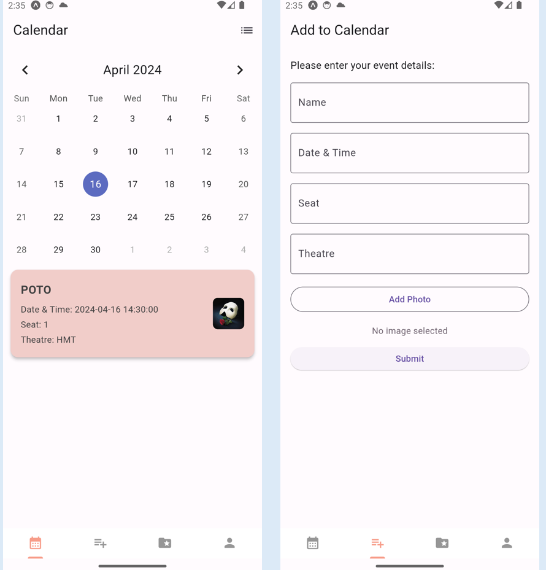
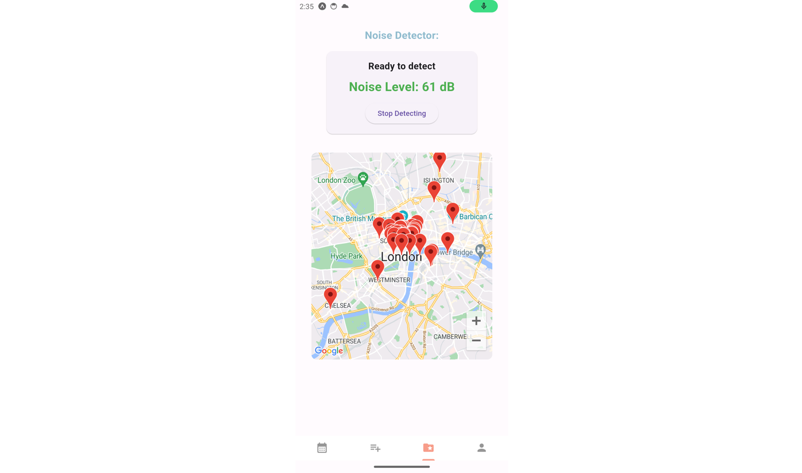

# StageMark - Your Theatre Companion

StageMark is a Flutter-based application designed for theatre lovers. StageMark is your personal assistant for managing your future theatre visits, musical evenings, and captivating performances, all within an elegant calendar interface. Experience an incredibly enjoyable journey through the theatre with our unique environment-connected feature.

### Landing Page
https://immathilda33.github.io/

## Features


### 🗓 Calendar Management
- **Personalized Stage List:** Effortlessly add and manage your anticipated theatre and performance events.
- **Event Insights:** Delve into comprehensive details about each event, including showtimes, seat information, and some photos from the scene!



### 🌐 Connected Environment Integration
- **Venue Directions:** Utilize integrated googleMap for navigation to your next theatre destination.
- **Ambient Sound Check:** Employ the noise detection feature to measure your physical environment, ideal for outdoor or unique performance spaces.



### :hammer_and_pick: How To Install The App

1. Clone the repository:
   ```
   git clone https://github.com/imMathilda33/StageMark.git
   ```

2. Change directory to the project folder:
   ```
   cd stagemark
   ```

3. Install all necessary dependencies:
   ```
   flutter pub get
   ```

4. Launch StageMark on your device:
   ```
   flutter run
   ```


### :thought_balloon: Contact me
- Feel free to contact me at: mathilda332023@outlook.com


